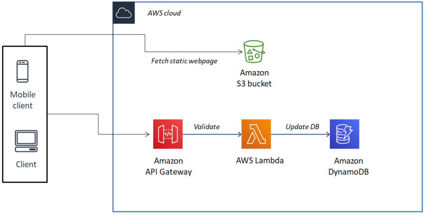

# Serverless-payment-solution
This repository contains source code for the demo application which was explained in http://deciphertoknow.com/serverless-payment-solution-architecture/ . Demo application is a payments solution same as GooglePay, PayTM. Where we show how to use QR code to scan and  transfer amount to payee using camera application, and it shows how to handle server-side with lowest cost possible.

Following is the block diagram using AWS service, implying usage of serverless architecture.

